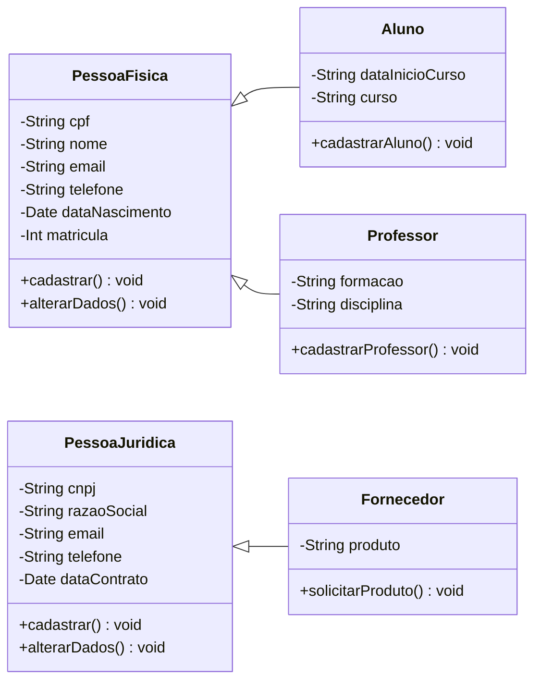
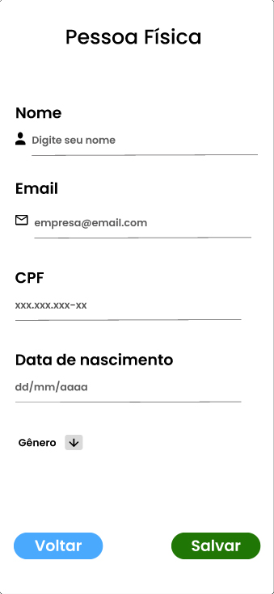
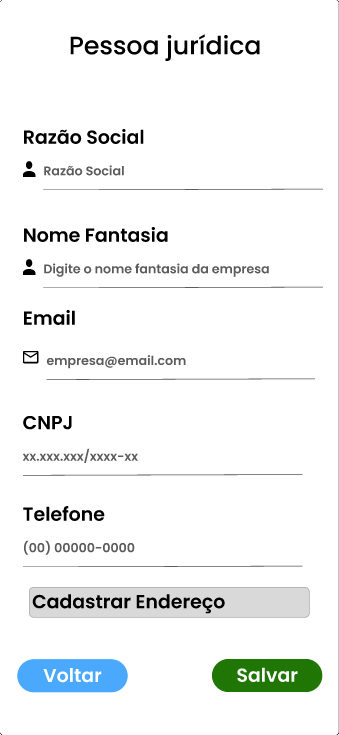
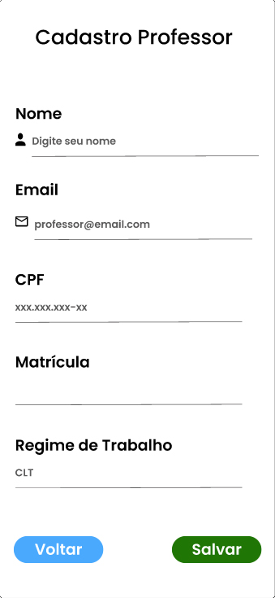
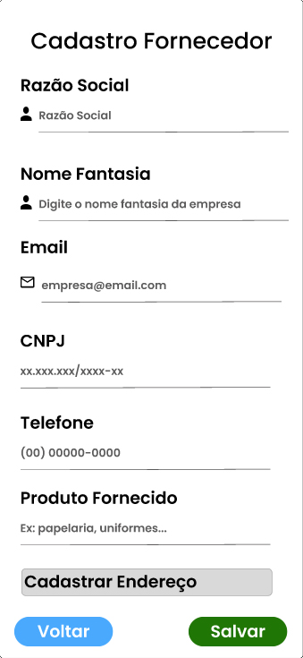
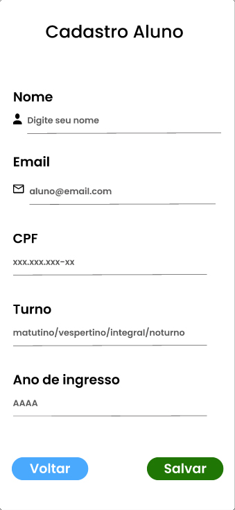
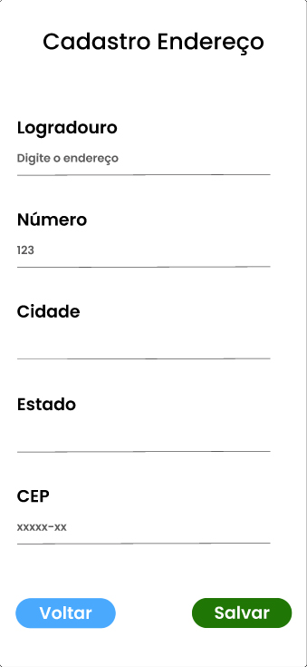

# 
Centro Universitário Senac

## 
Curso de Tecnologia em Análise e Desenvolvimento de Sistemas

### 
PROJETO INTEGRADOR: DESENVOLVIMENTO DE SISTEMAS ORIENTADO A OBJETOS

---

## Sistema de Gestão Universitária

Este projeto foi desenvolvido como parte de um trabalho acadêmico e tem como objetivo a modelagem de um sistema Orientado a Objetos voltado para a gestão de dados de uma grande universidade.  

No repositório, você encontrará:
- Protótipo e interface criados na plataforma Figma;
- Imagens e recursos visuais utilizados no projeto;
- [Scripts SQL](pi_ads.sql) com comandos DML e DDL para criação e manipulação do banco de dados;
- [Documentação](https://github.com/AlexandreGarciaJr/Projeto-Integrador-Grupo-22-2025/blob/main/PI%20-%201entrega.pdf) detalhada com especificações dos casos de uso;

---
## 
Diagrama de caso de uso

  

O sistema de cadastro descrito permite que o usuário registre diferentes perfis — Pessoa Física, Professor, Aluno, Pessoa Jurídica e Fornecedor — aplicando validações específicas de CPF ou CNPJ conforme o tipo escolhido; todos os cadastros são então salvos no banco de dados, e a partir desse ponto o sistema realiza duas ações complementares: envia um e-mail de confirmação ao usuário e comunica a instituição, garantindo tanto a persistência segura das informações quanto a integração administrativa.

---

## 
Diagrama de classe

O diagrama de classes descreve a estrutura de entidades e suas relações dentro de um sistema de cadastro. Ele define duas classes principais — Pessoa Física e Pessoa Jurídica — que representam os tipos básicos de usuários, cada uma com atributos próprios e métodos de manipulação de dados.

A partir dessas classes, derivam especializações:
- Aluno e Professor herdam de Pessoa Física, adicionando atributos específicos (curso, data de início, formação, disciplina) e métodos de cadastro próprios.
- Fornecedor herda de Pessoa Jurídica, incluindo o atributo de produto e o método solicitarProduto().

Assim, o modelo mostra como diferentes perfis de usuários compartilham características comuns de suas classes base, mas também possuem comportamentos especializados, garantindo reuso de código, organização e clareza na modelagem do sistema.

---

<h2 align="center">Print do protótipo funcional

  
  
  
  
  
  

  
  
  
  

#### O protótipo frontend foi desenvolvido no sistema Figma, com intuito de ilustrar o funcionamento do sistema de cadastro das diversas personas, com o funcionamento de botões e links para diferentes telas.

---

<a href="https://www.figma.com/design/LMhpXw9bbJf7Kk8JglNNBw/Projeto-Integrador---Segunda-entrega?node-id=0-1&t=1auQyhuDTl0yMqdD-1">Link para o figma</a> com o projeto do protótipo

[Clique aqui](https://www.figma.com/proto/LMhpXw9bbJf7Kk8JglNNBw/Projeto-Integrador---Segunda-entrega?node-id=1-7&p=f&t=95RlP2G6VHUAIwWp-1&scaling=scale-down&content-scaling=fixed&page-id=0%3A1&starting-point-node-id=1%3A7) para testar o protótipo funcional

## Colaboradores
<table>
  <tr>
    <td align="center">
      <a href="https://github.com/Pamelacimirro">
        
         
        <b>Pâmela</b>
      </a>
       
    </td>
      <td align="center">
      <a href="https://github.com/aironvalentim">
        
         
        <b>Airon</b>
      </a>
       
    </td>    <td align="center">
      <a href="https://github.com/AlexandreGarciaJr">
        
         
        <b>Alexandre</b>
      </a>
       
      </td>    <td align="center">
      <a href="https://github.com/AlvesX25">
        
         
        <b>Anderson</b>
      </a>
       
    </td>    <td align="center">
      <a href="https://github.com/gmcasagrande">
        
         
        <b>Guilherme</b>
      </a>
       
    </td>    <td align="center">
      <a href="https://github.com/gustvcarvalho">
        
         
        <b>Gustavo</b>
      </a>
       
    </td>    <td align="center">
      <a href="https://github.com/Maycon-on">
        
         
        <b>Maycon</b>
      </a>
       
    </td>
  </tr>
  <tr>
</table>
